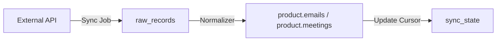

# Integrations Space

The Integrations space handles all communication with third-party platforms. It is designed as an ETL (Extract, Transform, Load) system that treats the CRM `product` space as the final destination for normalized data.

## Schema: `integrations`

This schema is isolated from the product schema to handle high-volume raw data and sync metadata.

### Tables

| Table         | Purpose                                                                          |
| :------------ | :------------------------------------------------------------------------------- |
| `connections` | Stores OAuth tokens, credentials, and **enabled capabilities**.                  |
| `sync_state`  | Stores incremental sync markers (cursors, historyIds) for each capability.       |
| `raw_records` | The **Buffer**. Stores exact JSON responses from providers before normalization. |

---

## Capabilities

A single Connection (e.g., Google) can provide multiple independent **Capabilities**. These can be enabled or disabled per connection.

### Example: Gmail Provider

- **`sync_inbox_live`**: Background sync of emails based on tags (sent, inbox, etc) to the CRM timeline.
- **`sync_inbox_once`**: Manual sync of emails based on parameters to the CRM timeline.
- **`send_email`**: On-demand action to draft and send emails via the CRM UI.
- **`sync_calendar_live`**: Syncing events between Google Calendar and CRM Meetings.
- **`sync_calendar_once`**: Manual sync of events between Google Calendar and CRM Meetings.

### Implementation

- **Isolation**: Each capability is independent. A failure in `sync_inbox` does not prevent `send_email` from working.
- **Scopes**: We request the minimum OAuth scopes required for the specific set of enabled capabilities.
- **Settings**: Per-capability configuration is stored in the `settings` column of the `connections` table.

---

## Ownership Models

### 1. User-Owned (e.g., Gmail)

- Private to the individual tenant user (`profile_id` is NOT NULL).
- Used for personalized email/calendar sync.

### 2. Tenant-Owned (e.g., Slack, Quickbooks)

- Shared across the entire tenant (`profile_id` is NULL).
- Used for organization-wide integrations.

---

## Data Lifecycle

1.  **Sync Job**: Fetches data from the provider (Google, Twilio, etc.).
2.  **Staging**: Data is stored as-is in `raw_records`.
3.  **Normalization**: Logic in `src/spaces/integrations/lib/normalizers` maps the raw JSON to the CRM's unified schema.
4.  **Deduplication**: The normalizer ensures we don't create duplicate CRM records if the same raw data is processed twice.

---

## Re-Processing

Because we store `raw_records`, we can re-run normalization at any time. If we add a new feature to the CRM (e.g., extracting phone numbers from email signatures), we can re-process the existing raw data without hitting third-party API rate limits.
